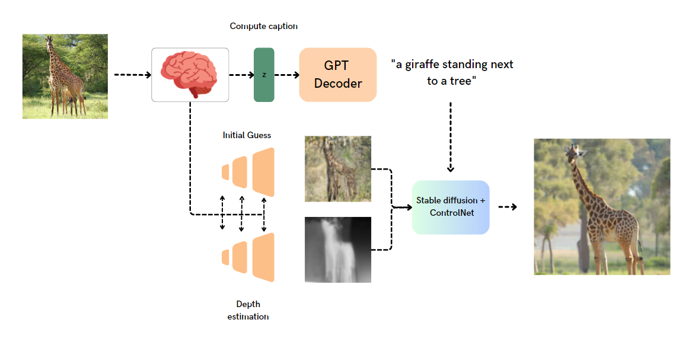
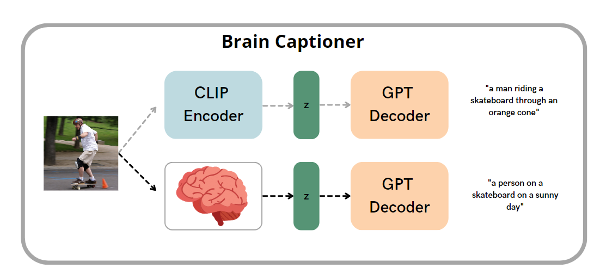
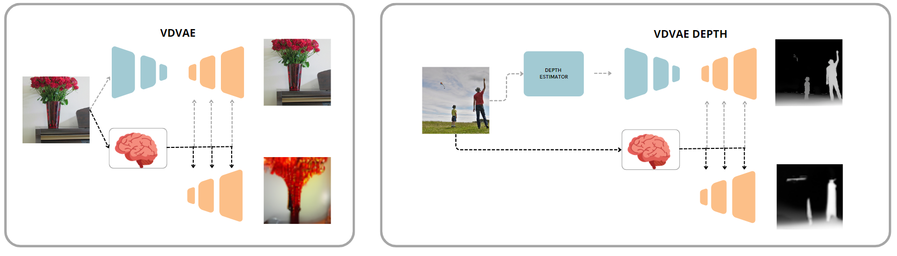
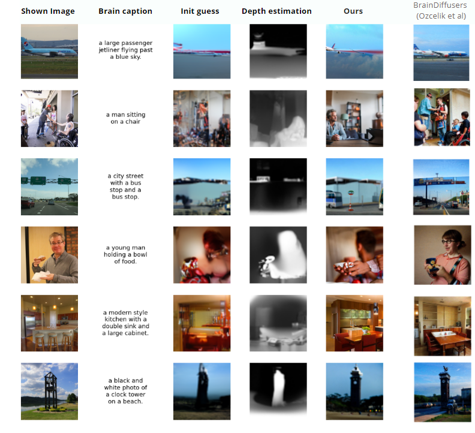
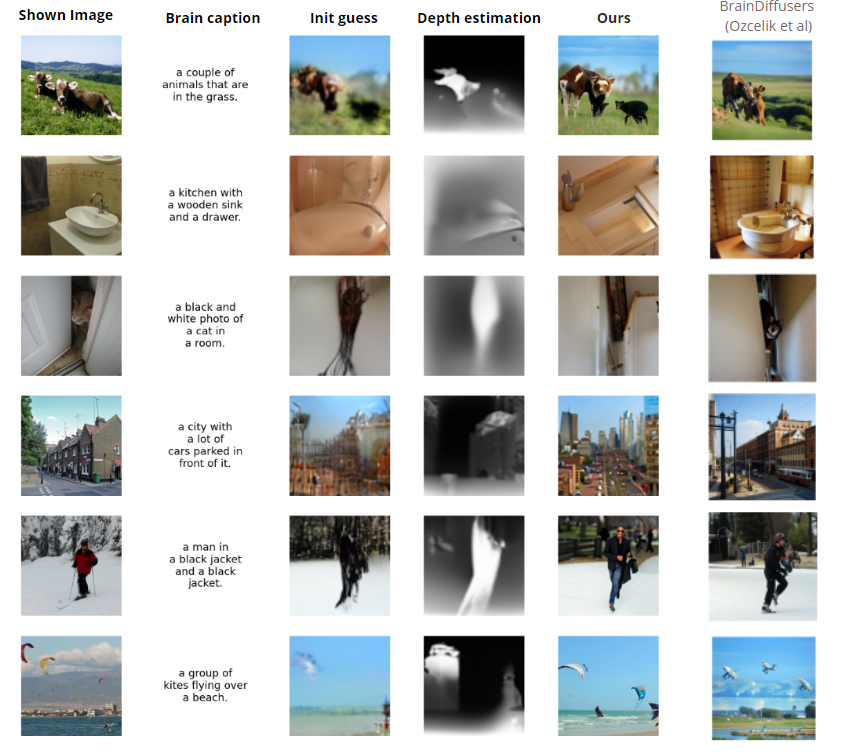
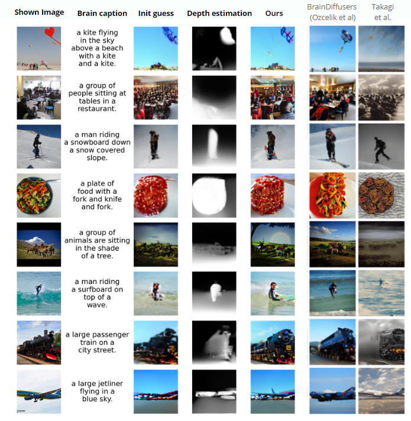
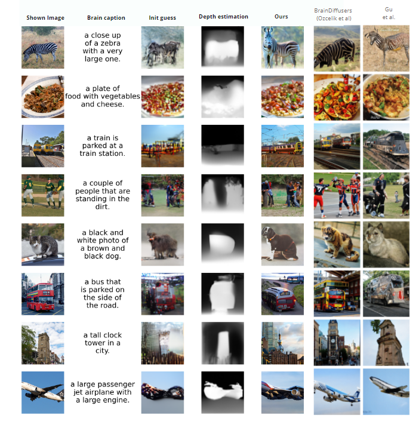

# Github Repository for BrainCaptioning Paper

The human brain processes a vast amount of visual information daily, with complex neural mechanisms underlying the perception and interpretation of these stimuli. Recent advances in functional magnetic resonance imaging (fMRI) have allowed researchers to decode visual information from brain activity patterns in humans.
We introduce a pioneering method for decoding brain activity into meaningful images and captions, with a specific emphasis on brain captioning because of increased flexibility rather than images. Our approach leverages the latest advancements in image captioning models, along with a novel image reconstruction pipeline based on latent diffusion models and depth estimation. By combining these techniques, we demonstrate significant progress in brain decoding, showcasing the enormous potential of integrating vision and language to better understand human cognition.

This work propose a pipeline for caption and image decoding from brain activity based on the NSD dataset.

**Data** can freely requested and downloaded at 
https://naturalscenesdataset.org/ or using the python code "download_nsddata.py" and "prepare_nsddata_captions.py" elaborated from the "BrainDiffusers" github repository (https://github.com/ozcelikfu/brain-diffuser/tree/671f1403fe2a0515771c29d64fb839153cf12f5e). To reproduce the pipeline reproduce the first step from this repository to download vdvae weights and frmi data. You'll also need the COCO captions, downloadable from https://cocodataset.org/#home, 2017 split.

After that, you can train the models from brain activity with the GIT_captioning notebook.

Our model is composed by a *brain to caption pipeline* 
 to generate image captions from brain activity.

This is also augmented with a pipeline for actual image reconstruction

**Results**

**References** 
BrainDiffusers code from Ozcelik et al: https://github.com/ozcelikfu/brain-diffuser/tree/671f1403fe2a0515771c29d64fb839153cf12f5e
OpenAI VDVAE: https://github.com/openai/vdvae
NSD Dataset: https://naturalscenesdataset.org/